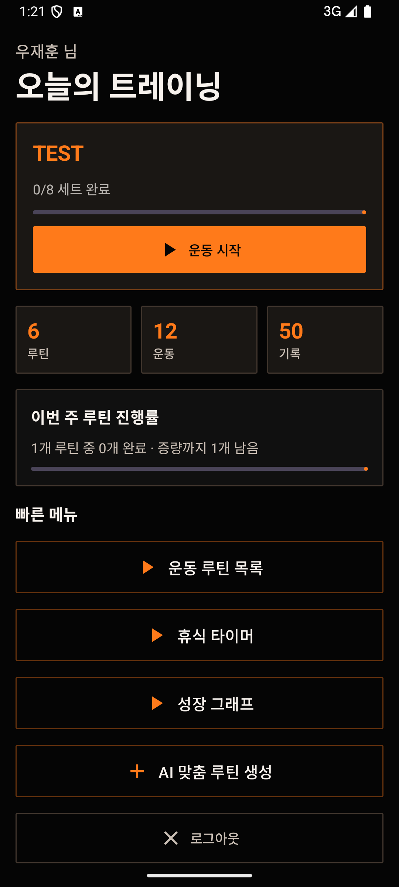
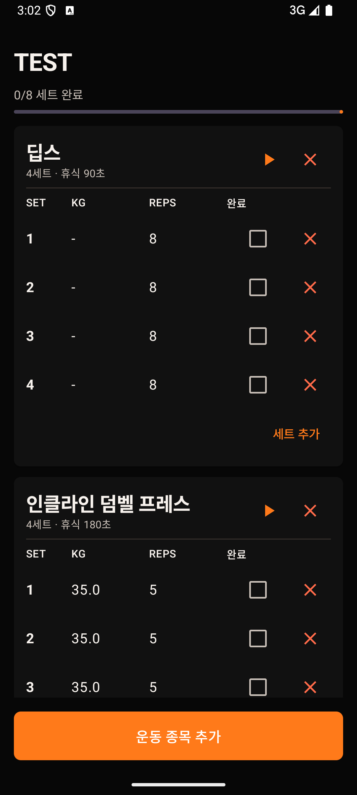
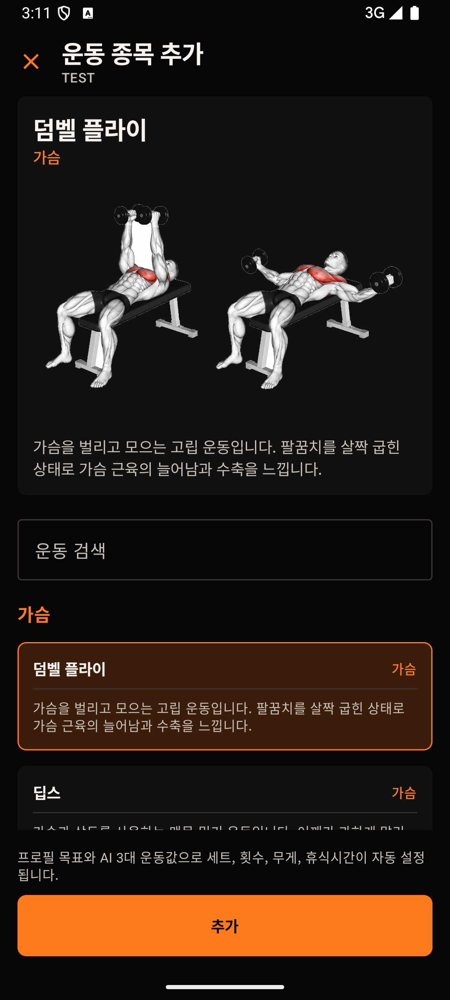
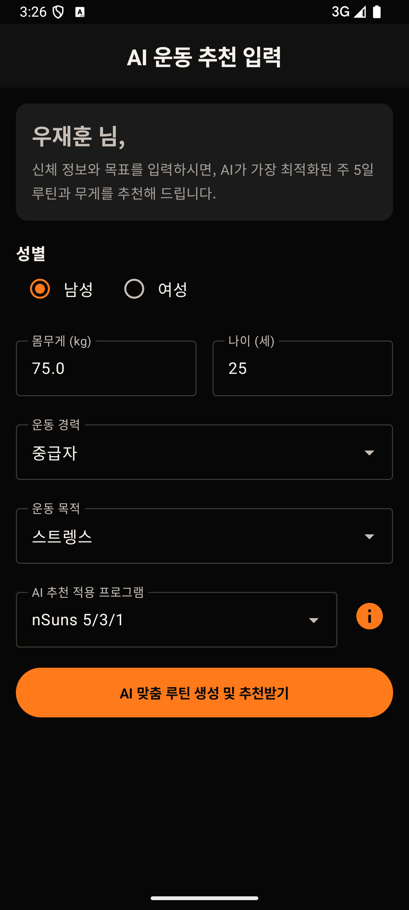
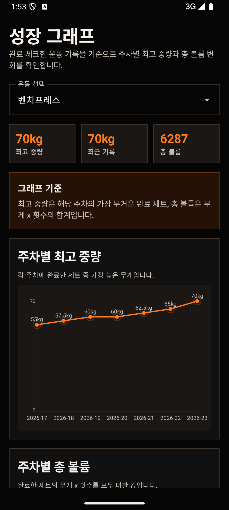

# PhysicalTraining

AI 맞춤 루틴 생성, 운동 체크리스트, 자동 기록 저장, 성장 그래프를 하나의 흐름으로 연결한 Android 헬스 트레이닝 앱입니다.

## 앱 소개

**PhysicalTraining**은 사용자의 기본 신체 정보와 운동 목표를 바탕으로 개인화된 운동 루틴을 만들고, 운동 수행 기록을 체크리스트와 성장 그래프로 관리할 수 있도록 만든 모바일 프로그래밍 프로젝트입니다. 단순히 운동 목록을 보여주는 앱이 아니라, 회원가입 이후 프로필 입력, AI 맞춤 루틴 생성, 운동 수행, 휴식 타이머, 기록 저장, 주차별 성장 확인까지 실제 헬스 루틴 진행 과정을 하나의 앱 안에서 이어지게 구성했습니다.

헬스 초보자는 어떤 운동을 어느 정도 무게와 반복 수로 시작해야 하는지 판단하기 어렵고, 중급자와 상급자는 자신의 목적에 맞는 체계적인 프로그램을 꾸준히 진행하고 관리하는 것이 중요합니다. 
이 앱은 회원가입 직후 이름, 나이, 몸무게, 운동 경력, 운동 목표를 입력받고, AI 예측값과 보정 공식을 활용해 루틴의 기본 운동 강도를 자동으로 설정합니다. 
이후 사용자는 운동을 완료할 때마다 기록을 저장하고, 주차별 최고 중량과 총 볼륨 변화를 확인하면서 자신의 운동 흐름을 관리할 수 있습니다.

기획 의도는 **초보자에게는 시작 기준을 제시하고, 중급자와 상급자에게는 체계적인 프로그램 진행과 기록 관리를 돕는 것**입니다. 따라서 앱은 운동 추천 자체보다도 “추천된 루틴을 실제로 수행하고, 수행 결과가 다음 기록과 성장 그래프에 반영되는 구조”에 초점을 두었습니다.

## 주요 기능

### 1. AI 맞춤 루틴 생성

사용자 프로필과 운동 목표를 기반으로 3대 운동 기준 중량을 예측하고, 앱 내부 안정 보정 로직을 통해 실제 루틴에 사용할 수 있는 중량으로 다듬습니다. 
운동 경력과 목적에 따라 초보자 전신 루틴, PPL 분할 루틴, 5x5, GVT, 파워리프팅 피킹 등 다양한 템플릿 중 적합한 프로그램을 추천합니다.
AI 모델이 반환한 값은 그대로 사용하지 않고, 성별, 몸무게, 운동 경력, 운동 목적을 기준으로 한 번 더 안정 보정을 거칩니다. 이를 통해 과하게 높거나 낮은 값이 바로 루틴에 들어가는 문제를 줄이고, 운동 목적에 따라 세트 수, 반복 수, 휴식 시간의 성격도 달라지도록 구성했습니다.

- 운동 목적별 루틴 강도 조절
- 벤치프레스, 스쿼트, 데드리프트 기준 중량 추천
- 운동 경력과 목표에 따른 루틴 템플릿 자동 선택
- AI 출력값을 몸무게, 성별, 운동 경력 기준으로 보정
- 루틴 생성 후 요일별 운동 계획 자동 구성

### 2. 운동 체크리스트와 자동 기록 저장

생성된 루틴 안에서 운동별 세트, 반복 수, 중량을 확인하고 완료 여부를 체크할 수 있습니다. 세트를 완료하면 운동 기록이 로컬 데이터베이스에 저장되고, 원격 백업이 가능한 상태에서는 Firebase에도 동기화됩니다.
운동 체크리스트는 실제 운동 중 가장 많이 보는 화면이기 때문에, 운동명, 세트 수, 중량, 반복 수, 완료 여부를 한눈에 확인할 수 있도록 구성했습니다. 사용자가 세트를 완료하면 휴식 타이머로 자연스럽게 이동하고, 완료된 세트 기록은 성장 그래프 계산의 기준 데이터로 사용됩니다.

- 운동별 세트, 반복 수, 중량 확인
- 완료 체크 시 운동 기록 저장
- 세트 삭제 및 운동 삭제 기능
- 주간 루틴 전체 완료 시 다음 주 증량 여부 안내
- 네트워크 문제 발생 시 백업 실패 안내
- Firebase 기반 원격 백업 및 복원

### 3. 휴식 타이머

운동 세트를 완료하거나 운동별 타이머 버튼을 누르면 휴식 타이머 화면으로 이동합니다. 사용자는 휴식 시간을 확인하면서 다음 세트를 준비할 수 있고, 필요하면 시간을 줄이거나 늘릴 수 있습니다.
또한 상단에 앱 어디서나 확인 가능한 전역 타이머를 지원하여 앱 내 어디서든 확인이 가능합니다.

- 세트 완료 후 자동 타이머 화면 이동
- 운동별 휴식 시간 반영
- 10초 단위 휴식 시간 조절
- 자유 휴식 타이머 제공

### 4. 운동 종목 추가

루틴 상세 화면에서 운동을 추가할 수 있습니다. 운동 목록은 부위별로 정리되어 있으며, 선택한 운동의 이미지와 간단한 설명을 확인한 뒤 루틴에 추가할 수 있습니다. 
운동을 추가할 때는 AI가 예측한 3대 운동 기준값과 사용자의 운동 목적을 활용해 해당 운동의 기본 세트 수, 반복 수, 무게, 쉬는 시간이 자동으로 설정됩니다.
운동 추가 화면은 별도의 작은 팝업이 아니라 전체 화면으로 구성되어, 운동 이미지를 크게 확인하면서 운동을 고를 수 있습니다. 상단에는 선택된 운동 이미지와 설명을 고정하고, 아래 운동 목록만 스크롤되도록 하여 사용자가 운동 자세를 보려고 화면을 계속 오르내리지 않아도 되게 했습니다.

- 가슴, 등, 하체, 어깨, 팔, 복근 등 부위별 운동 카탈로그
- 운동 이미지 고정 미리보기
- 운동 설명 제공
- 루틴 안에서 필요한 운동만 추가
- AI 기반 기본 세트 수, 반복 수, 무게, 쉬는 시간 자동 입력
- 유사 운동명은 대표 이름으로 묶어 보여주되 기존 루틴 데이터는 유지

### 5. 성장 그래프

완료 체크된 운동 기록을 기준으로 주차별 최고 중량과 총 볼륨 변화를 그래프로 확인할 수 있습니다. 
단순히 운동을 완료하는 것에서 끝나지 않고, 기록이 실제로 증가하고 있는지 시각적으로 확인할 수 있도록 구성했습니다.
성장 그래프는 완료된 운동 기록만 기준으로 계산되며, 운동 종목별로 최근 기록, 최고 기록, 총 볼륨을 함께 보여줍니다. 사용자는 특정 운동을 선택해 주차별 최고 중량 변화와 주차별 총 볼륨 변화를 확인할 수 있습니다.

- 운동 종목별 기록 조회
- 주차별 최고 중량 변화
- 주차별 총 볼륨 변화
- 운동 진행 상황을 시각적으로 확인
- 최근 기록과 최고 기록 요약

### 6. 백업 및 복원

운동 기록과 루틴 데이터는 Room Database에 우선 저장되고, Firebase Firestore를 통해 원격 백업할 수 있도록 구성했습니다. 기존에는 사용자가 직접 백업 버튼을 눌러야 했지만, 현재는 운동 세트를 완료하는 흐름에서 자동 백업이 이루어지도록 개선했습니다. 네트워크 문제가 발생하면 실패 상황만 사용자에게 안내하여 운동 중 불필요한 알림을 줄였습니다.

- Room 기반 로컬 저장
- Firebase Firestore 기반 원격 백업
- 세트 완료 후 자동 백업 시도
- 네트워크 연결 실패 시 백업 실패 안내
- 계정 기반 데이터 복원 지원

### 7. 전체 UI 디자인

전체 UI는 검정색 배경과 주황색 포인트 컬러를 중심으로 구성했습니다. 헬스 앱의 강한 인상과 운동 기록 앱의 가독성을 함께 살리기 위해, 카드와 버튼은 각진 형태로 정리하고, 주요 액션 버튼은 주황색으로 통일했습니다. 운동 이미지도 다크한 배경에서 잘 보이도록 배치해 운동 자세 확인이 쉽도록 했습니다.

## 실행 화면

| 홈 화면 | 운동 체크리스트 화면 | 운동 종목 추가 화면 |
| --- | --- | --- |
|  |  |  |

| AI 맞춤 루틴 추천 화면 | 성장 그래프 화면 |
| --- | --- |
|  |  |

## 기술 스택

### 개발 언어 및 플랫폼

- **Kotlin 2.0.21**: Android 앱 전체 로직과 UI를 구현한 주 언어입니다.
- **Android SDK 36 / minSdk 35 / targetSdk 36**: 프로젝트 제출 기준에 맞춰 Android 15 이상 환경을 기준으로 구성했습니다.
- **Java 11**: Gradle 및 Android 컴파일 옵션에서 Java 11 호환성을 사용합니다.

### UI 프레임워크

- **Jetpack Compose**: XML 레이아웃 대신 Kotlin 코드로 화면을 선언하는 UI 프레임워크입니다. 홈, 체크리스트, 운동 추가, AI 입력, 성장 그래프 등 주요 화면을 Compose 기반으로 구성했습니다.
- **Compose BOM 2024.09.00**: Compose 관련 라이브러리 버전을 일관되게 관리하기 위해 사용했습니다.
- **Material 3**: Button, Card, TextField, Dialog, TopAppBar 등 기본 UI 컴포넌트를 구성하는 데 사용했습니다. 앱에서는 Material 3를 기반으로 검정/주황 다크 테마와 각진 버튼 스타일을 적용했습니다.

### Android Jetpack 라이브러리

- **Activity Compose 1.13.0**: Android Activity에서 Compose 화면을 실행하기 위해 사용했습니다.
- **Lifecycle Runtime KTX 2.10.0**: 화면 생명주기와 비동기 작업을 안정적으로 다루기 위해 사용했습니다.
- **ViewModel Compose 2.11.0-beta01**: 화면 상태와 운동 루틴 생성, 기록 저장, 백업 처리 같은 비즈니스 로직을 UI와 분리하기 위해 사용했습니다.
- **Navigation Compose 2.7.7**: 홈, 로그인, 프로필 입력, 루틴 목록, 체크리스트, 운동 추가, 타이머, 성장 그래프 화면 간 이동을 관리하기 위해 사용했습니다.

### 데이터베이스 및 로컬 저장

- **Room Database 2.8.4**: 운동 루틴, 운동 세트, 완료 기록, 성장 그래프 계산용 데이터를 로컬에 저장하기 위해 사용했습니다. SQLite를 직접 다루는 대신 Entity, DAO, Database 구조로 안정적인 데이터 접근이 가능하도록 구성했습니다.
- **Room KTX 2.8.4**: Room 작업을 Kotlin Coroutines와 함께 처리하기 위해 사용했습니다.
- **KSP 2.0.21-1.0.28**: Room 컴파일러 코드 생성을 위해 사용했습니다.
- **SharedPreferences**: 로그인 후 기본 사용자 설정과 간단한 상태 값을 저장하는 데 사용했습니다.
- **JSON Assets**: 운동 종목 이름, 부위, 설명, 이미지 매칭 정보를 앱 내부 assets로 관리했습니다.
- **PNG/GIF Assets**: 운동 자세 이미지와 운동 시각 자료를 앱 내부 리소스로 제공했습니다.

### AI 및 추천 로직

- **TensorFlow Lite 2.17.0**: 앱 내부 AI 모델을 실행해 벤치프레스, 스쿼트, 데드리프트 기준 중량을 예측하는 데 사용했습니다.
- **Google Generative AI SDK 0.9.0**: AI 기능 확장 가능성을 고려해 포함한 Google AI 클라이언트 라이브러리입니다.
- **앱 내부 보정 공식**: AI 예측값을 그대로 적용하지 않고 성별, 몸무게, 운동 경력, 운동 목적을 기준으로 안정 보정했습니다.
- **운동 목적별 처방 로직**: 스트렝스, 근비대, 다이어트, 유지/재활 목적에 따라 세트 수, 반복 수, 휴식 시간, 운동 강도가 달라지도록 구성했습니다.
- **운동별 중량 배율 로직**: 3대 운동 기준값을 기반으로 보조 운동의 무게를 자동 계산해 운동 추가 시 기본값으로 입력되도록 했습니다.

### 이미지 처리

- **Coil Compose 2.6.0**: Compose 화면에서 운동 PNG 이미지를 비동기 로딩하기 위해 사용했습니다.
- **Coil GIF 2.6.0**: 기존 GIF 운동 자료를 표시하기 위해 사용했습니다.

### 인증 및 원격 백업

- **Firebase Authentication**: 회원가입과 로그인 기능을 구현하기 위해 사용했습니다.
- **Firebase Firestore**: 운동 루틴, 운동 기록, 사용자 데이터를 원격으로 백업하고 복원하기 위해 사용했습니다.
- **Firebase BOM 34.10.0**: Firebase 라이브러리 버전을 통합 관리하기 위해 사용했습니다.
- **Google Services Gradle Plugin 4.4.4**: Android 프로젝트에 Firebase 설정 파일을 연결하기 위해 사용했습니다.
- **kotlinx-coroutines-play-services 1.10.2**: Firebase 비동기 작업을 Kotlin Coroutine 방식으로 처리하기 위해 사용했습니다.

### 비동기 및 상태 관리

- **Kotlin Coroutines**: Room 저장, Firebase 백업, AI 모델 실행처럼 시간이 걸리는 작업을 메인 스레드를 막지 않고 처리하기 위해 사용했습니다.
- **StateFlow**: 루틴 목록, 체크리스트 상태, 사용자 프로필, 타이머 상태 등을 UI에 실시간으로 반영하기 위해 사용했습니다.

### 빌드 및 테스트 도구

- **Gradle Kotlin DSL**: Gradle 설정을 Kotlin 문법으로 관리했습니다.
- **Android Gradle Plugin 9.0.1**: Android 앱 빌드 구성을 담당합니다.
- **JUnit 4.13.2**: 단위 테스트용 라이브러리입니다.
- **AndroidX JUnit 1.3.0 / Espresso 3.7.0**: Android 계측 테스트 및 UI 테스트 기반 라이브러리입니다.
- **Compose UI Test JUnit4**: Compose UI 테스트를 위한 라이브러리입니다.

### 핵심 구현 로직

- **AI 출력 안정 보정 로직**: AI 모델이 반환한 중량이 지나치게 높거나 낮아지는 것을 막기 위해 사용자 조건 기반 보정값을 적용합니다.
- **운동 자동 처방 로직**: 운동 추가 시 목적별 세트 수, 반복 수, 무게, 휴식 시간이 자동 입력됩니다.
- **주간 루틴 완료 및 증량 로직**: 하루 루틴 하나가 아니라 일주일 루틴 전체가 완료되었을 때 증량 여부를 확인하고 다음 주 루틴에 반영합니다.
- **운동 기록 그래프 로직**: 완료된 운동 기록을 주차별로 묶어 최고 중량과 총 볼륨을 계산합니다.
- **자동 백업 로직**: 세트 완료 후 로컬 저장을 먼저 수행하고, 네트워크가 가능하면 Firebase 원격 백업을 시도합니다.

## 자료 및 영상 링크

* **2분 요약 영상**: [Google Drive에서 보기](https://drive.google.com/file/d/1_6ql4m90QXS4MXu3lOsEqCG-4zk7iZFd/view?usp=share_link)
* **10분 상세 발표 영상**: [YouTube에서 보기](https://youtu.be/d6h99HvJSZ0)
* **프로젝트 최종 보고서 PDF**: [final_report.pdf](docs/final_report.pdf)
* **APK 다운로드**: [Google Drive에서 다운로드](https://drive.google.com/file/d/1p0qLIxFPGJW5suyWXUuYtgyCa902_DWN/view?usp=share_link)

